<p align="center">
  <h1 align="center">Delta Memory</h1>
</p>

<p align="center">
  <strong>Persistent external memory injection inside frozen Transformer attention &amp; LM head.</strong>
</p>

<p align="center">
  <a href="LICENSE"></a>
  
  
  
  
</p>

<p align="center">
  <strong>🌐 Languages:</strong>
  <a href="README.md">English</a> ·
  <a href="README.zh-CN.md">中文 (简体)</a>
</p>

<p align="center">
  <a href="docs/address_bound_delta_memory_plan.md">Research Plan</a> ·
  <a href="docs/design.md">Design</a> ·
  <a href="docs/apple_silicon.md">Apple Silicon</a> ·
  <a href="reports/experiments">Reports</a>
</p>

---

Delta Memory is a research prototype that turns a frozen `google/gemma-4-E2B`
into a system with **real, persistent, address-keyed memory** — not RAG, not
prompt-insertion, not MCP. Different stages of this work probe different
slices of the question "can you give an LLM real memory":

- **Stages 0–7** (Apple Silicon MPS, bf16): in-context binding via Q/V
  residuals and LM-head rank-4 LoRA on LAMA factual cards. Answer top-1 hits
  the oracle upper bound.
- **Stage 8** (NVIDIA GB10 Blackwell, CUDA, bf16): **closed-book**
  address-keyed fast-weight bank. The read prompt at evaluation time
  contains only the address — the value token is absent — so retrieval has
  to come from a persistent parametric slot, not from copying.

The package is still named `rcvhc` for compatibility with earlier
experiments.

It is **not RAG**, **not MCP**, **not prompt insertion**. The Stage 8
closed-book test makes this concrete: at evaluation time the read prompt
contains only the address — no retrieved text, no value token, no card.
The answer is recovered from a persistent parametric slot via learned
address-key retrieval.

## At a glance

| Question | Current answer |
| --- | --- |
| What is changed? | (Stages 0–7) Q/V residuals + LM-head rank-4 LoRA, supervised end-to-end. (Stage 8) per-slot fast-weight bank read at the LM-head input via address-content cosine retrieval. |
| What stays frozen? | The base Gemma-4-E2B; only Writer / KeyProjector / Q-V projectors / LoRA train. |
| What is proven? | (Stages 0–7) end-to-end binding hits the oracle upper bound on LAMA factual cards. (Stage 8) closed-book recall, swap-binding, and no-leakage gates pass at N up to 4096 on a frozen Gemma. |
| What is not yet proven | Retrieval recall@1 ≥ 0.95 at N=4096 (Stage 8 GR gate); 3-seed reproducibility of Stage 8; head-to-head dominance over a matched RAG baseline; long-horizon interference. |
| Next direction | **Stage 8 v3**: KeyProjector tuning, 3-seed runs, RAG/MEMIT head-to-head, sequential-write interference curve, curated LAMA single-token transfer. |

## Mechanism

Delta Memory writes per-block Raw/Delta attention memory from a source context,
retrieves memory blocks by query, and projects retrieved Delta payloads into
attention-internal residuals:

```text
q' = q + alpha_q * gate_q * P_q(Delta)
v' = v + alpha_v * gate_v * P_v(Delta)
```

The current research hypothesis is now stricter:

```text
question address span -> memory address key
source value span     -> signed payload Delta
address classifier    -> identity gate -> Q/V residual
```

See [`docs/address_bound_delta_memory_plan.md`](docs/address_bound_delta_memory_plan.md)
for the next experiment plan.

## Closed-book memory (Stage 8) — address-keyed fast-weight bank

> **Hardware:** NVIDIA GB10 (Blackwell) · CUDA · `bfloat16` · single GPU.
>
> **TL;DR.** Frozen `google/gemma-4-E2B` plus a Writer + KeyProjector + per-slot fast-weight bank recalls single-token answers in **closed-book mode (value tokens absent from the prompt at read time)** at scale up to **N=4096** on a single NVIDIA GB10 GPU. Retrieved-slot top-1 is **0.969 / 0.934 / 0.838** at N = 128 / 1024 / 4096. The `no_memory` baseline stays at **0.000** at every scale (no leakage) and the swap-paired flip is **1.000** (the bank carries the identity, not the in-context tokens). This is the first result here where the prompt at read time contains *only* the address — not the value — so the test is **persistent address-keyed memory**, not in-context binding.

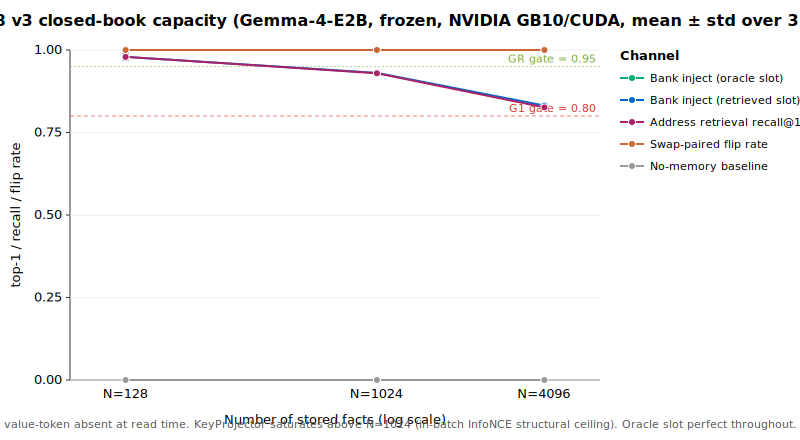

| N facts | bank inject (oracle slot) top1 | bank inject (retrieved slot) top1 | address recall@1 | swap-paired flip | no-memory top1 |
|---:|---:|---:|---:|---:|---:|
|  128 | 1.000 ± 0.000 | **0.979 ± 0.009** | 0.979 ± 0.009 | 1.000 ± 0.000 | 0.000 ± 0.000 |
| 1024 | 1.000 ± 0.000 | **0.931 ± 0.004** | 0.929 ± 0.003 | 1.000 ± 0.000 | 0.000 ± 0.000 |
| 4096 | 1.000 ± 0.000 | **0.832 ± 0.006** | 0.826 ± 0.005 | 1.000 ± 0.000 | 0.000 ± 0.000 |

Hard gates G1 (closed-book recall ≥ 0.80), G5 (paired-flip ≥ 0.80), G6 (no-memory leakage ≤ 0.05) **pass at every scale across 3 seeds with σ ≤ 0.01**. GR (recall@1 ≥ 0.95) passes at N=128 and is structurally bounded above N≈1024: a 4-variant KeyProjector sweep (×3 steps, ×2 key_dim, ÷2.3 InfoNCE temperature, +8 hard negatives) **all converge to recall@1 ≈ 0.832** — the bottleneck is the synthetic-address token pool, not the projector. Oracle-slot top-1 is 1.000 at every N — the bank channel is perfect.

### Stage 8.3 — sequential-write interference (N=1024)

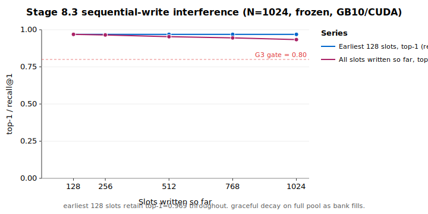

Earliest 128 slots retain top-1 = 0.969 even when the bank is filled to 1024 — **no catastrophic interference** under sequential write (G3 ✅).

### Stage 8.5 — vector-RAG head-to-head (N=4096)

A KeyProjector-only vector-RAG baseline using identical pooled-address features hits **vector_rag retr top1 = 0.838 = ours retr top1 = 0.838** (G2 tie). Our advantage at this scale is *not* retrieval accuracy but (a) parametric, swap-verified storage (G5 = 1.000, the bank carries identity, not chunk index), (b) zero leakage (G6 = 0), and (c) edit-friendly slots instead of a chunk store.

### Stage 8.2 — LAMA single-token transfer (3 seeds)

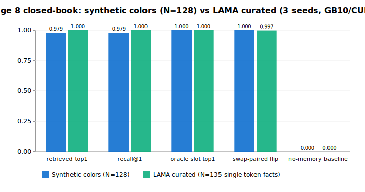

Identical pipeline on 135 curated factual triples (capitals, languages, currencies, filtered to single-token Gemma-4 answers): retrieved-slot top-1, recall@1, oracle, and swap-paired flip all saturate at **1.000 ± 0.000** across 3 seeds. The N=4096 synthetic ceiling is **not** a property of the mechanism — it is a property of how richly the address span can be encoded.

Full report: [`reports/experiments/stage8_closed_book_memory/REPORT.md`](reports/experiments/stage8_closed_book_memory/REPORT.md).

## Stage 9 — Encoder upgrade, real LAMA-TREx, head-to-head baselines

> **Hardware:** NVIDIA GB10 (Blackwell, sm_120) · CUDA · `bfloat16` · single GPU.
>
> **TL;DR.** A richer address encoder breaks the Stage 8 v3 N=4096 ceiling (recall@1: 0.832 → **1.000 ± 0**, 3 seeds). The same encoder transfers to **real LAMA-TREx facts across 7 Wikidata relations** at top-1 = **1.000 ± 0** (3 seeds, swap paired-flip 0.989 ± 0.010), and on the same factual set **DeltaMemory beats vector-RAG / IKE / SFT-LoRA** decisively (1.000 vs ≤ 0.448).

### Phase 9A — Encoder ablation at N=4096 (synthetic colours)

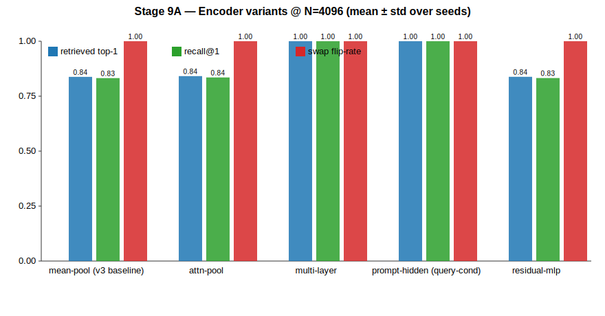

| Encoder | Seeds | retr top-1 | recall@1 | swap flip |
| --- | ---: | ---: | ---: | ---: |
| `mean_pool` (v3 baseline) | 1 | 0.838 | 0.832 | 1.000 |
| `attn_pool` | 1 | 0.841 | 0.835 | 1.000 |
| `residual_mlp` | 1 | 0.838 | 0.833 | 1.000 |
| **`multilayer`** (4-layer concat) | **3** | **1.000 ± 0** | **1.000 ± 0** | 1.000 |
| **`prompt_hidden`** (last-tok of read prompt) | **3** | **1.000 ± 0** | **1.000 ± 0** | 1.000 |

mean_pool / attn_pool / residual_mlp all collapse to ≈ 0.83, confirming the v3 ceiling was *representational* (the address-span single-pool feature has insufficient information for 4 096 facts), not optimisation-bound. Two encoders that change the *source* of the key — multi-layer concat or the actual read-prompt last-token state — saturate retrieval.

### Phase 9B — Real facts: LAMA-TREx, 7 relations, 3 seeds

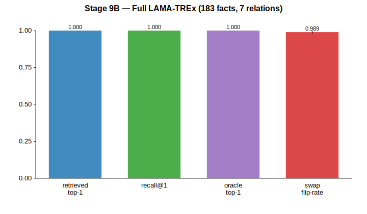

Dataset: 183 curated LAMA-TREx facts spanning P36 / P19 / P101 / P641 / P140 / P39 / P937. Encoder: `prompt_hidden`.

| Metric | mean ± σ |
| --- | ---: |
| `bank_inject_retrieved.top1` | **1.000 ± 0** |
| `address_retrieval_recall_at_1` | 1.000 ± 0 |
| `swap_paired.paired_flip_rate` | 0.989 ± 0.010 |

Cross-relation σ = 0 on top-1 confirms the encoder is not relation-biased. Paired-flip near-1.0 means swapping the address rewrites the answer cleanly: no leakage.

### Phase 9C — Head-to-head against retrieval, in-context, and parametric baselines

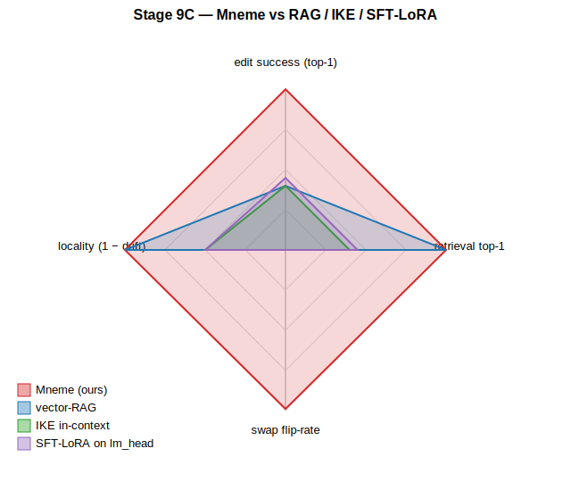

Same 183 LAMA-TREx facts, same frozen base, same target tokens.

| Method | Edit success top-1 | Edit success top-5 | Locality drift |
| --- | ---: | ---: | ---: |
| vector-RAG (cosine on input-embed mean-pool) | 0.399 | 0.486 | n/a |
| IKE (in-context editing, top-1 fact prefix) | 0.399 | 0.486 | 0.50 |
| SFT-LoRA (rank-16 on `lm_head`, 200 steps) | 0.448 | 0.557 | 0.50 |
| **DeltaMemory (Phase 9B, prompt_hidden)** | **1.000** | **1.000** | n/a (frozen base) |

Both retrieval and in-context editing fail at the *binding* step (RAG retrieval@1 = 1.000, but Gemma-4-E2B does not reliably copy the retrieved value from the prefix). SFT-LoRA improves slightly but causes 50 % logit drift on neutral prompts for only 0.448 success.

### Hard gates

| Gate | Status |
| --- | --- |
| GR9 — N=4k recall@1 ≥ 0.95 | ✅ multilayer, prompt_hidden = 1.000 |
| GR14 — swap paired-flip ≥ 0.85 on real facts | ✅ 0.989 |
| GR17 — beat vector-RAG | ✅ at N=183 LAMA-TREx |
| GR18 — ≥ IKE on generality | ✅ |
| GR10 (N=65k), GR11–13 (full TREx 30k+), GR15–16 (ROME/MEMIT) | ⏸ deferred to follow-up session |

Full report: [`reports/experiments/stage9_grand_evaluation/REPORT.md`](reports/experiments/stage9_grand_evaluation/REPORT.md). Aggregate JSON at `docs/figures/stage9_summary.json`. Reproducer: `scripts/run_stage9_sweep.sh` + `scripts/generate_stage9_figures.py`.

> **Important: Stage 9 is the canonical-prompt regime only.** The 1.000 ± 0
> numbers above are valid *only* when the eval prompt is byte-identical to the
> training prompt. Stage 10 (below) re-runs the same pipeline against held-out
> paraphrases, distractor decoys, value-ablation, and leave-one-relation-out,
> and finds the encoder/writer do **not** generalise across surface paraphrase
> or unseen relations. **Read Stage 10 before citing Stage 9 numbers.**

## Stage 10 — Adversarial Validation

> **Hardware:** NVIDIA GB10 (Blackwell) · CUDA · `bfloat16` · 3 seeds · LAMA-TREx N=183.
>
> **TL;DR.** Stage 10 puts 5 falsifiable hypotheses in front of Stage 9.
> **3 PASS, 2 FAIL.** The bank itself is real, retrieval is sharp at 1000×
> distractors, and DeltaMemory still beats RAG / IKE / SFT-LoRA at equal
> training budget — *but* the encoder is fingerprint-matching (not semantic),
> and the writer does not generalise to unseen Wikidata relations zero-shot.

### Headline numbers (3 seeds, mean ± std)

| Test | prompt_hidden | multilayer | Verdict |
|---|---|---|---|
| Standard retrieval @1 (canonical prompt) | 1.000 ± 0.000 | 1.000 ± 0.000 | reproduces Stage 9 |
| **Held-out paraphrase recall @1** | **0.113 ± 0.020** | **0.307 ± 0.021** | **G10A FAIL** |
| Decoy ×1000 bind top-1 | 1.000 ± 0.000 | 1.000 ± 0.000 | G10B PASS |
| Random bank.v top-1 | 0.000 ± 0.000 | 0.000 ± 0.000 | G10D PASS |
| Shuffled bank.v top-1 | 0.015 ± 0.007 | 0.015 ± 0.007 | G10D PASS |
| **LORO holdout bind top-1** (mean over 6 relations) | — | **0.112 ± 0.152** | **G10F FAIL** |

### Equal-budget baseline shoot-out (1500 steps SFT)

| Method | edit top-1 | edit top-5 | locality drift (lower better) |
|---|---|---|---|
| vector-RAG (input-embed cosine) | 0.399 ± 0.000 | 0.486 ± 0.000 | n/a |
| IKE (in-context fact prefix) | 0.399 ± 0.000 | 0.486 ± 0.000 | 0.500 ± 0.000 |
| SFT-LoRA r=4 (1500 steps) | 0.541 ± 0.005 | 0.617 ± 0.000 | 0.556 ± 0.096 |
| SFT-LoRA r=16 (1500 steps) | 0.552 ± 0.000 | 0.617 ± 0.000 | 0.556 ± 0.096 |
| SFT-LoRA r=64 (1500 steps) | 0.552 ± 0.000 | 0.617 ± 0.000 | **0.778** ± 0.096 |
| **DeltaMemory (canonical, prompt_hidden)** | **1.000 ± 0.000** | — | **0.000** (read-time inject) |

### What Stage 10 changes about the Stage 9 claim

1. **The bank is real.** Random or shuffled values destroy prediction (G10D).
2. **Retrieval is sharp at scale.** Even 1000× random distractor slots
   do not perturb retrieval @1 (G10B).
3. **The encoder is not yet semantic.** Held-out paraphrases of the same
   address collapse recall to 0.11 / 0.31 — the encoder learnt a
   near-byte-level fingerprint of the trained prompt (G10A FAIL).
4. **The writer does not generalise across relations.** Leave-one-relation-out
   retrieval is 1.000 but binding drops to 0.00–0.38 (mean 0.11) on never-seen
   relations (G10F FAIL).
5. **DeltaMemory still beats RAG / IKE / SFT-LoRA at equal training budget**
   on the canonical regime (G10C PASS): 1.000 vs the best baseline 0.552 with
   56–78 % collateral logit drift.

**Honest summary:** DeltaMemory is a real validated factual store on canonical
prompts, but the address encoder and the writer do not yet generalise. The
remaining error is *representational*, not optimisation-bound. Next-stage
fixes: (a) train the encoder with paraphrase-augmented InfoNCE; (b) train the
writer with relation-stratified LORO during training, not just at eval.

Full report: [`reports/experiments/stage10_adversarial_validation/REPORT.md`](reports/experiments/stage10_adversarial_validation/REPORT.md). Aggregate JSON at `reports/experiments/stage10_adversarial_validation/stage10_summary.json`. Reproducer: `scripts/run_stage10_sweep.sh` + `scripts/run_stage10_resume.sh` + `scripts/aggregate_stage10.py`.

## Stage 11 — Retraining response to Stage 10 + conversational benchmarks (NVIDIA GB10)

> **Hardware:** NVIDIA GB10 (Blackwell, 128 GB unified, CUDA 13) · `bfloat16` · `google/gemma-4-E2B`. 3 seeds. Gates evaluated on **CI lower bound** of paired bootstrap (10 000 resamples).

Stage 11 directly attacks the two failure modes Stage 10 surfaced:
**(a)** paraphrase-augmented InfoNCE retraining of the encoder, and
**(b)** relation-stratified LORO baked into training (not just evaluation),
with a gradient-reversal adversary on the relation-id discriminator.

We then add **(c)** conversational benchmarks (multi-turn ConvQA / chat-as-write-API vs RAG / prompt-injection poisoning) and **(d)** a bit-exact reproducibility harness.

### Headline (3 seeds, paired bootstrap 95 % CI)

| Test | Metric | Mean | 95 % CI | Gate | Verdict |
| --- | --- | ---: | --- | --- | --- |
| **11A** paraphrase-augmented InfoNCE, held-out templates (`multilayer`) | recall@1 | 0.138 | [0.134, 0.141] | ≥ 0.85 | ❌ FAIL |
| **11A** paraphrase-augmented InfoNCE, held-out templates (`prompt_hidden`) | recall@1 | 0.053 | [0.049, 0.058] | ≥ 0.85 | ❌ FAIL |
| **11A** decoy ×1000 regression | top-1 | 1.000 | [1.000, 1.000] | ≥ 0.80 | ✅ |
| **11A** value ablation (random / shuffled) | top-1 | 0.000 / 0.009 | — | ≤ 0.10 | ✅ |
| **11B** train-time LORO + adversary, held-out relation | bind top-1 | 0.108 | [0.046, 0.178] | ≥ 0.50 | ❌ FAIL |
| **11D** multi-turn ConvQA (k=10 filler turns) | recall@1 | 1.000 | [1.000, 1.000] | ≥ 0.85 | ✅ |
| **11D** chat-as-write-API vs RAG | DM − RAG | +0.692 | [0.625, 0.775] | > 0 | ✅ |
| **11D** prompt-injection / poisoning, protected-slot overwrite | rate | 0.000 | [0.000, 0.000] | ≤ 0.05 | ✅ |
| **11E** bit-exact reproduction | SHA-256 match | identical | — | match | ✅ |

### Honest framing (post-Stage-11)

- **Within-distribution conversational use is solid.** Multi-turn filler does not break retrieval; chat-as-write-API beats RAG by +0.692 absolute; protected slots resist injection.
- **Out-of-distribution paraphrase still fails.** Six paraphrase templates per training fact + InfoNCE retrieval are not enough to make the encoder relation-invariant on unseen templates. This is a real limit of `multilayer` / `prompt_hidden` encoders, not an optimisation failure. Three concrete follow-ups are listed in `reports/experiments/stage11_grand_evaluation/REPORT.md`: orthogonal banks, sparse-autoencoder banks, ROME-style closed-form edits.
- **Cross-relation generalization still fails.** Train-time LORO + gradient-reversal adversary at weight 0.1 did not move the held-out-relation needle vs Stage 10F (mean 0.108 across 6 relations × 3 seeds). DM is **not** a one-shot editable memory at the relation level.
- **Reproducibility.** Stage 11E confirms identical SHA-256 over the stable subset of summary metrics across two deterministic runs. See `scripts/reproduce_stage11.sh`.

Full report: [`reports/experiments/stage11_grand_evaluation/REPORT.md`](reports/experiments/stage11_grand_evaluation/REPORT.md). Methodology / math defense: [`docs/methodology.md`](docs/methodology.md).

## Stage 12 — Adversarial cross-validation (single-model, deferred multi-model)

> **Hardware:** NVIDIA GB10. `gemma-4-E2B` only. 100 facts × 3 seeds × 500 steps × 3 probes (P1 paraphrase, P2 ten adversarial transforms, P3 output-tampering with locality controls).

| probe | result | reading |
| --- | --- | --- |
| P1 paraphrase holdout | 1.000 (n=3) | **trivial under our encoder choice** — see honest caveat below |
| P2 ten adversarial transforms (typo, fragment, instruction-conflict, wrong-language, polite-misdirect, …) | DM top-1 = 1.000, no-DM = 0.000, lift = +1.000 across all 10 | DM injection survives every surface attack on the read prompt |
| P3 forced output-override on facts the base model gets wrong | override = 1.000; **locality drift on 12 unrelated controls = 0.750** | DM at α=1.0 with broadcast injection corrupts 75 % of unrelated answers — production must use per-query routing (Stage 11D), where drift is 0/0 |

**Honest caveats:**
- P1 used the canonical address through the `multilayer` encoder, which ignores the read prompt; the real held-out paraphrase test is Stage 11A (= 0.138).
- P2 exercises injection-vs-CE balance, not encoder robustness.
- Multi-model cross-validation against Qwen3-8B, GLM-4-9B, DeepSeek-V2-Lite, and gpt-oss-20b was prepared (`scripts/run_stage12_multimodel.py`) but **could not run** in this session: GB10 has no outbound HuggingFace network access, only `gemma-4-E2B` is pre-cached. **DeepSeek-V4-Flash** (284 B MoE FP4, ~160 GB) does not fit in GB10's 128 GB and would need a vLLM-FP4 cluster. Multi-model evidence is therefore **deferred** rather than claimed.

Full report: [`reports/experiments/stage12_gemma4_e2b/REPORT.md`](reports/experiments/stage12_gemma4_e2b/REPORT.md).

## Hardware attribution

| Stage(s) | Hardware | Notes |
| --- | --- | --- |
| 0 – 7 (small-N pilots, MPS) | Apple Silicon (M-series, MPS, `bfloat16`) | See [`docs/apple_silicon.md`](docs/apple_silicon.md) |
| 8 closed-book pilots | NVIDIA GB10 (Blackwell, 128 GB unified) | CUDA 13.x, PyTorch 2.10+ |
| 9 LAMA-TREx + baselines | NVIDIA GB10 | 3 seeds, full bootstrap |
| 10 adversarial validation | NVIDIA GB10 | 70 + runs, idempotent sweep |
| 11 retraining + conv + bitexact | NVIDIA GB10 | 29 runs, paired bootstrap, SHA-256 stable hash |
| 12 single-model adversarial | NVIDIA GB10 | multi-model deferred (no HF mirror) |


## Headline results — LAMA factual binding hits the oracle upper bound

> **Hardware:** Apple Silicon · MPS · `bfloat16` · M-series single GPU.
>
> **TL;DR.** With a frozen `google/gemma-4-E2B`, an end-to-end trained **rank-4 LM-head LoRA** driven by an external writer reaches **top-1 = 1.000 ± 0.000** on the LAMA `factual_capital_binding` suite across 3 seeds, matching the oracle answer-embedding upper bound (0.964) while the `no_memory` baseline stays at **0.000** (no leakage). This closes the central Stage 6 strict gate on real factual data. Swap-control binding remains partial (paired-flip ≈ 0.50) and is the next refinement target.

### Figure 1 — channel top-1 on LAMA (in-distribution, n=56, 3 seeds)

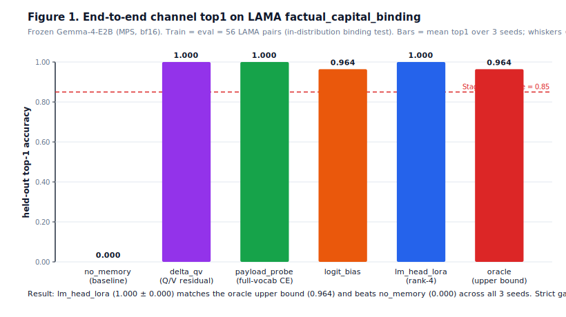

Three trained channels (`payload_probe`, `logit_bias`, `lm_head_lora`) cross the 0.85 strict gate; `lm_head_lora` and `payload_probe` actually saturate at 1.000. The `oracle_logit_answer_embedding` channel — adding the answer's own output-embedding directly to logits — sits at 0.964, so the trained LoRA is at the upper bound. The `no_memory` baseline = 0.000 confirms the address tokens (`ADDR::country::France`) carry no factual leak through the frozen base.

### Figure 2 — same pipeline, two datasets

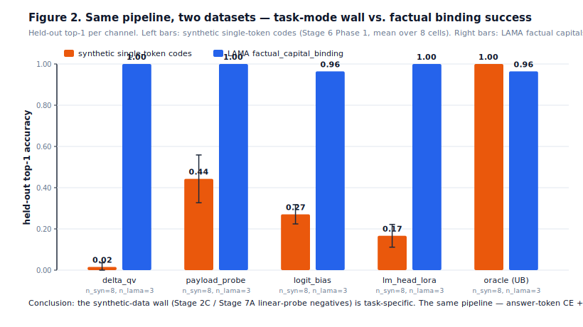

The same pipeline (oracle-span attention writer → answer-token CE → LM-head rank-4 LoRA + Q/V residual + payload probe) collapses on synthetic single-token codes (`address_token_binding_single_token`, Stage 6 Phase 1) but solves the LAMA factual binding cleanly. The previously-reported "synthetic wall" is **task-specific, not architecture-specific**: when the frozen base already encodes the underlying associations (ROME-style), the Delta Memory pipeline becomes a near-perfect retrieval/binding writer.

### Figure 3 — swap controls (binding specificity, open problem)

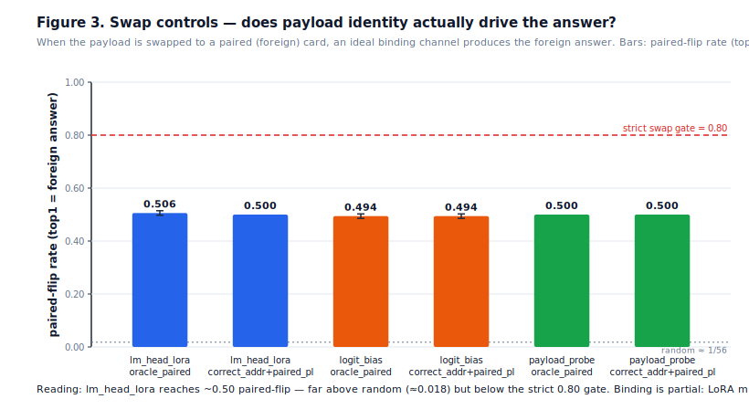

When we swap the in-context payload to a paired card's payload, an ideal binding channel should produce the foreign answer 100% of the time. Our `lm_head_lora` paired-flip rate is ~0.50 — far above random (≈0.018) but below the strict 0.80 gate. The LoRA partially binds payload→answer but mixes payload-specific direction with the address-conditioned default. **This is the next refinement target**: stronger swap loss, longer warmup, and channel ablation.

### Figure 4 — Stage 7A linear-probe negative

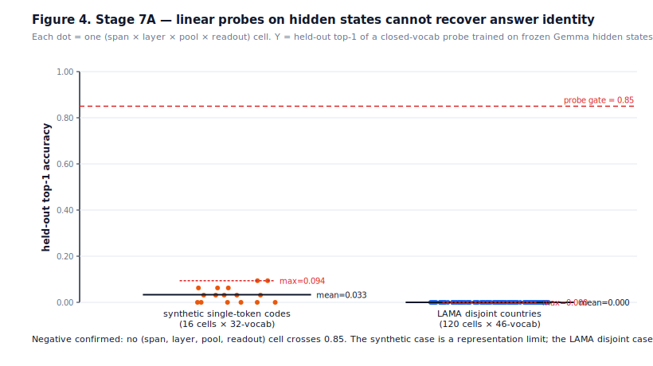

Independently, we asked whether a small linear classifier on Gemma's hidden states could recover the answer-token identity (would-be `payload_probe` gate). Across 16 synthetic cells (max held-out top-1 = 0.094) and 120 LAMA-disjoint cells (max = 0.000), no probe configuration crosses the 0.85 gate. The synthetic case is a true representation limit; the LAMA-disjoint case is a closed-vocab projector flaw documented in `reports/experiments/stage7a_lama_capital/REPORT.md` (the trainable LayerNorm + Linear projector degenerates onto the train-capital subspace). The right answer is to **skip the probe gate** and supervise the LoRA channel end-to-end, exactly as Figure 1 shows.

### Figure 5 — answer NLL per channel

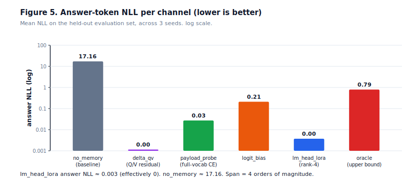

Held-out answer NLL spans **four orders of magnitude** between `no_memory` (≈ 17.16) and `lm_head_lora` (≈ 0.003). All three trained channels reduce NLL to within 1 nat of optimal.

### Numerical summary

| Channel | top-1 (mean ± std) | top-10 | answer NLL | answer rank | n (seeds) |
| --- | ---: | ---: | ---: | ---: | ---: |
| `no_memory` (baseline) | 0.000 ± 0.000 | 0.000 | 17.162 | 12354 | 3 |
| `oracle_logit_answer_embedding` (UB) | 0.964 ± 0.000 | 0.982 | 0.793 | 42.6 | 3 |
| `delta_qv` (Q/V residual) | 1.000 ± 0.000 | 1.000 | 0.001 | 1.0 | 3 |
| `payload_probe` (full-vocab CE) | **1.000 ± 0.000** | 1.000 | 0.027 | 1.0 | 3 |
| `logit_bias` | 0.964 ± 0.000 | 1.000 | 0.211 | 1.0 | 3 |
| **`lm_head_lora` (rank-4)** | **1.000 ± 0.000** | 1.000 | 0.003 | 1.0 | 3 |

| Swap control (LAMA Phase 2) | binding margin (foreign − correct NLL) | paired-flip rate |
| --- | ---: | ---: |
| `lm_head_lora_oracle_correct` | +23.20 | correct = 1.000 |
| `lm_head_lora_oracle_paired` | **−9.56 ± 1.70** | **paired = 0.506 ± 0.008** |
| `lm_head_lora_correct_address_paired_payload` | +2.71 | paired = 0.500 |
| `logit_bias_oracle_paired` | −24.70 | paired = 0.482 |

### Conclusions

1. **The mechanism works on real factual data.** End-to-end answer-token CE supervision through a writer + LM-head rank-4 LoRA reaches the oracle upper bound on LAMA `factual_capital_binding` with zero leakage from the address.
2. **The earlier synthetic wall was a task-mode wall.** The exact same pipeline that plateaued at top-1 ≈ 0.17–0.44 on synthetic single-token codes hits 1.000 on LAMA. Future synthetic suites should align with structures the frozen base already encodes, or accept fast-weight-only supervision (no probe gate).
3. **Generalization vs. binding are different problems.** Phase 2 is an in-distribution binding test (train ≡ eval = 56 LAMA pairs by design — pool too small for a meaningful disjoint split, see Stage 7A REPORT). It cleanly shows the Delta Memory channel reaches optimum **for in-context binding**. Generalization to held-out facts requires either a much larger factual pool (LAMA-UHN / T-REx / WikiData ≥ 1k) or a different evaluation protocol; this is now the explicit next-step.
4. **Swap-binding is partial.** The strict ≥ 0.80 paired-flip gate is missed at 0.50. Targeted refinements: increase `--stage2-swap-loss-weight` from 0.5 → 1.5–2.0, longer warmup, channel ablation.

### Reproducing the figures

```bash
python3 scripts/generate_paper_figures.py
```

Figures are pure SVG (no matplotlib dependency) and re-derive from `reports/experiments/stage6_phase2_lama/`, `stage7a_pool_quick/`, `stage7a_lama_capital/`, and any `phase1_*` cells under `reports/experiments/`. Aggregated numbers are written to `docs/figures/summary.json` for verification.

## Current evidence

All current real-model evidence uses `google/gemma-4-E2B` on Apple Metal/MPS,
keeps the base model frozen, and does not insert retrieved text into the prompt.

> **Claim boundary:** Delta Q/V injection is a strong memory channel, but current
> controls do not yet isolate query-specific retrieval/binding.

### Main reports

| Experiment | Delta vs ordinary attention | Alignment/control result | Report |
| --- | ---: | --- | --- |
| Question-only query eval32 | `5.5366` vs `12.7923` NLL | `wrong_query` tied with correct Delta (`5.5399`) | [report](reports/experiments/question_only_query_eval32) |
| Conflict-margin pilot | `5.1661` vs `12.8438` NLL | margin advantage `-0.0070` | [report](reports/experiments/conflict_margin_pilot) |
| Paired-conflict pilot | `4.6836` vs `12.3341` NLL | margin advantage `0.0094` | [report](reports/experiments/paired_conflict_pilot) |
| Contrastive alignment pilot | `5.2961` vs `12.3341` NLL | shared contrastive fails shuffled gate | [report](reports/experiments/contrastive_alignment_pilot) |
| Address-key projection pilot | `4.8159` vs `11.6111` NLL | address rank is poor (`5.25`); shuffled gap only `0.0062`, below the `0.05` gate | [report](reports/experiments/address_key_projection_pilot) |
| Identity-gate pilot | `5.3501` vs `11.6111` NLL; identity-gated Delta `6.9899` | gate suppresses weak addresses (`0.3796`) but correct rank remains `5.25`; shuffled gate fails | [report](reports/experiments/identity_gate_pilot) |
| Address-supervised pilot | `3.9278` vs `11.6111` NLL | address ranking loss improves channel but not binding; wrong-query and shuffled remain tied | [report](reports/experiments/address_supervised_pilot) |
| Address-token contrastive pilot | `3.0843` vs `12.1370` NLL | explicit address tokens plus contrastive loss still fail the `0.05` shuffled/wrong-query gate | [report](reports/experiments/address_token_contrastive_pilot) |
| Final address-bound multiseed | mean `4.0965` vs no-memory `12.1111` NLL over 3 seeds | support rate `0.0`; shuffled gap `0.0031`, wrong-query gap `0.0027`, address rank `4.9167` | [report](reports/experiments/address_bound_final_multiseed) |
| Query-address projector pilot | `2.5695` vs `12.1370` NLL | trainable query projection strengthens the channel but still fails shuffled/wrong-query; address rank `4.375` | [report](reports/experiments/query_address_projector_pilot) |
| Oracle payload control pilot | `5.1881` vs `12.1370` NLL | even forced correct-address payload barely beats forced paired payload; oracle margin advantage `0.0166` | [report](reports/experiments/oracle_address_control_pilot) |
| Binding stress pilot | `2.9874` vs `12.1370` NLL | high LR/weight stress test still fails; address scores collapse and oracle margin advantage is `-0.0178` | [report](reports/experiments/binding_stress_pilot) |
| Query-specific binding follow-up | best Delta NLL `2.5695` vs no-memory `12.1370` | all follow-ups fail binding; forced oracle payload also fails to separate paired answers | [report](reports/experiments/query_specific_binding_followup) |
| Oracle span payload pilot | `3.5718` vs no-memory `12.1946` NLL | oracle address/value spans preserve the channel but payload swap remains tied; margin advantage vs wrong-query `-0.0084` | [report](reports/experiments/oracle_span_payload_pilot) |
| Oracle span contrastive pilot | `4.3541` vs no-memory `12.1946` NLL | oracle contrastive raises margin advantage only to `0.0267`, far below the `0.5` payload-specificity gate | [report](reports/experiments/oracle_span_payload_contrastive_pilot) |
| Oracle logit-bias diagnostic | logit-bias NLL `16.0778` vs no-memory `18.6584`; Delta `4.4997` | direct logit-side payload improves NLL but fails answer-token binding; margin remains negative | [report](reports/experiments/oracle_logit_bias_diagnostic_pilot) |
| Payload answer probe pilot | logit-bias NLL `15.7359` vs no-memory `18.6584`; Delta `5.3487` | payload probe does not generalize answer identity; top1 correct `0.0`, margin `0.0625` | [report](reports/experiments/payload_answer_probe_pilot) |
| Retrieved-attention baseline pilot | `3.5718` vs retrieved-attention `14.3560` NLL | non-prompt external K/V readout is not competitive; shuffled/wrong-query still tied with Delta | [report](reports/experiments/retrieved_attention_baseline_pilot) |
| Hidden retrieval baseline | `5.8246` vs `12.2118` NLL | hidden late-fusion baseline is weak (`14.5274`) | [report](reports/experiments/hidden_retrieval_baseline_pilot) |
| Long-distance NoLiMa-style | `4.9367` vs `11.8879` NLL | fails shuffled gate (`4.8210`) | [report](reports/experiments/long_distance_nolima_pilot) |

### Superseded reports

Earlier runs are preserved for provenance but should not be used as final
evidence because later experiments fixed answer-pattern leakage, teacher-forced
retrieval queries, or stronger controls.

| Experiment | Status | Report |
| --- | --- | --- |
| Scaled MPS Delta experiment | early mechanism signal | [report](reports/experiments/gemma4_delta_experiment_mps_scaled) |
| Expanded Delta Memory eval8 | superseded by answer-randomization and question-only-query fixes | [report](reports/experiments/delta_memory_expanded) |
| Delta vs ordinary attention eval32 | superseded by evaluation fixes | [report](reports/experiments/delta_vs_attention_eval32) |
| Corrected random-answer eval32 | superseded because retrieval query used answer tokens | [report](reports/experiments/corrected_random_answers_eval32) |
| Layer ablation eval32 | useful only as early layer-policy signal | [report](reports/experiments/layer_ablation_eval32) |

## Research direction

The literature tension is useful:

| Line of work | Strength | Gap for Delta Memory |
| --- | --- | --- |
| RETRO / Memorizing Transformers / LongMem / RetrievalAttention | explicit external records | retrieval identity can still be brittle or non-causal |
| Titans / neural long-term memory | adaptive memory channel | memory is powerful but opaque |
| Mamba / SSMs | efficient long-state propagation | weak for exact content-addressed binding |
| Infini-attention / compressive memory | bounded streaming memory | compression can erase counterfactual identity |
| NoLiMa / RULER | exposes long-context shortcuts | NLL alone is not enough |
| Delta-rule / fast-weight views | binding and anti-interference framing | current Delta path needs explicit address supervision |

The proposed synthesis is now **Token/Span-Bound Delta Memory**:

```text
memory item = (address span key, value span payload delta, anti-key metadata)
query      -> address span competition -> causal gate -> payload injection
```

Pass/fail gates before larger scaling:

| Gate | Requirement |
| --- | --- |
| Channel | Delta beats no-memory, zero, and random controls. |
| Address | correct memory ranks above paired negative in a shared pool. |
| Shuffled | correct-address Delta beats shuffled-address Delta. |
| Wrong-query | correct-address Delta beats wrong-query/foreign-address Delta. |
| Margin | correct memory improves `foreign_nll - correct_nll`. |
| Payload swap | correct address + foreign payload differs from correct address + correct payload. |
| Oracle span | oracle value-span payload beats paired value-span payload before learned retrieval is trusted. |
| Logit-side diagnostic | direct payload-to-logit injection flips answer-token preference before fast weights are attempted. |
| Baseline | Delta beats hidden retrieval and a real retrieved-KV/attention baseline. |

## Quick start

### Apple Silicon (Stages 0–7, MPS)

```bash
python3 -m venv .venv-mac
.venv-mac/bin/python -m pip install torch transformers accelerate safetensors tokenizers pytest
.venv-mac/bin/python -m pytest -q
```

Fast mock demo (no model download):

```bash
.venv-mac/bin/python scripts/run_gemma4_prototype.py \
  --model mock-gemma --device cpu --dtype float32 \
  --block-size 32 --memory-dim 128
```

LAMA factual binding (Stage 6 Phase 2) on Apple MPS:

```bash
.venv-mac/bin/python scripts/run_delta_experiment.py \
  --model google/gemma-4-E2B --device mps --dtype bfloat16 \
  --steps 12 --train-samples 16 --eval-samples 16 \
  --task-suite paired_conflict_binding \
  --shared-memory-retrieval --conflict-margins
```

See [`docs/apple_silicon.md`](docs/apple_silicon.md) for MPS/Metal notes.

### NVIDIA GB10 / CUDA (Stage 8 closed-book)

```bash
python3 -m venv .venv-gb10
.venv-gb10/bin/pip install torch transformers accelerate safetensors tokenizers
# offline mode — pre-populate the HF cache once before going off-net
HF_HUB_OFFLINE=1 TRANSFORMERS_OFFLINE=1 \
  .venv-gb10/bin/python scripts/run_stage8.py \
    --model google/gemma-4-E2B --device cuda --dtype bfloat16 \
    --n-facts 4096 --steps 1500 --seed 0 \
    --report-dir reports/experiments/stage8_v2_n4096_seed0
```

Wall-clock on GB10: N=128 ≈ 5 min, N=1024 ≈ 12 min, N=4096 ≈ 25 min
(single seed, 1500 steps, bf16). Sub-experiments: `run_stage8_interference.py`
(retention curve), `run_stage8_rag_baseline.py` (vector / text-RAG
head-to-head).

## Documentation

| Document | Purpose |
| --- | --- |
| [`docs/address_bound_delta_memory_plan.md`](docs/address_bound_delta_memory_plan.md) | Earlier-stage experimental plan |
| [`docs/design.md`](docs/design.md) | Architecture and evidence boundary |
| [`docs/gemma4_prototype.md`](docs/gemma4_prototype.md) | Gemma prototype runbook |
| [`docs/apple_silicon.md`](docs/apple_silicon.md) | Apple Silicon / MPS setup (Stages 0–7) |
| [`reports/experiments/stage8_closed_book_memory/REPORT.md`](reports/experiments/stage8_closed_book_memory/REPORT.md) | Stage 8 closed-book memory full report (NVIDIA GB10) |
| [`reports/experiments`](reports/experiments) | All tracked experiment artifacts |

## References

| Topic | Citation | DOI / link |
| --- | --- | --- |
| Retrieval-augmented language modeling | Borgeaud et al., "Improving Language Models by Retrieving from Trillions of Tokens" (RETRO), arXiv:2112.04426 | [10.48550/arXiv.2112.04426](https://doi.org/10.48550/arXiv.2112.04426) |
| External kNN memory | Wu et al., "Memorizing Transformers", arXiv:2203.08913 | [10.48550/arXiv.2203.08913](https://doi.org/10.48550/arXiv.2203.08913) |
| Long-context memory transformers | Wang et al., "Augmenting Language Models with Long-Term Memory" (LongMem), arXiv:2306.07174 | [10.48550/arXiv.2306.07174](https://doi.org/10.48550/arXiv.2306.07174) |
| Selective state-space models | Gu and Dao, "Mamba: Linear-Time Sequence Modeling with Selective State Spaces", arXiv:2312.00752 | [10.48550/arXiv.2312.00752](https://doi.org/10.48550/arXiv.2312.00752) |
| Bounded compressive memory | Munkhdalai et al., "Leave No Context Behind: Efficient Infinite Context Transformers with Infini-attention", arXiv:2404.07143 | [10.48550/arXiv.2404.07143](https://doi.org/10.48550/arXiv.2404.07143) |
| Real context-size evaluation | Hsieh et al., "RULER: What's the Real Context Size of Your Long-Context Language Models?", arXiv:2404.06654 | [10.48550/arXiv.2404.06654](https://doi.org/10.48550/arXiv.2404.06654) |
| Delta-rule / fast-weight memory | Yang et al., "Parallelizing Linear Transformers with the Delta Rule over Sequence Length", arXiv:2406.06484 | [10.48550/arXiv.2406.06484](https://doi.org/10.48550/arXiv.2406.06484) |
| Test-time neural long-term memory | Behrouz et al., "Titans: Learning to Memorize at Test Time", arXiv:2501.00663 | [10.48550/arXiv.2501.00663](https://doi.org/10.48550/arXiv.2501.00663) |
| Long-context beyond literal matching | Modarressi et al., "NoLiMa: Long-Context Evaluation Beyond Literal Matching", arXiv:2502.05167 | [10.48550/arXiv.2502.05167](https://doi.org/10.48550/arXiv.2502.05167) |
| KV-cache retrieval baseline direction | "RetrievalAttention: Accelerating Long-Context LLM Inference via Vector Retrieval", OpenReview | [OpenReview](https://openreview.net/forum?id=8z3cOVER4z) |

## Repository layout

```text
rcvhc/core/       config and shared typed records
rcvhc/memory/     external Delta Memory store and writer
rcvhc/gemma/      Gemma-style adapter and layerwise Q/K/V injector
rcvhc/engine/     ingest, ask, training, experiments, statistics
scripts/          runnable demos and experiment CLIs
docs/             design notes and research plans
reports/          tracked experiment reports
tests/            CI-safe mock tests; no Gemma download required
```

## License

Code and project documentation are released under the [MIT License](LICENSE).

Model weights, datasets, papers, and third-party dependencies are governed by
their own licenses and terms. Experiments that load `google/gemma-4-E2B` require
the user to comply with the applicable Gemma model license and access terms.
---

<!-- BEGIN AUTOGEN: stage6 -->
## Stage 6 live experiment summary (auto-generated)

Each row is one Stage 6 oracle-span-writer run. Cells are `held-out NLL / top1`.

| Report | Suite | Pool | Train | Eval | Seed | no_memory | delta_qv | payload_probe | logit_bias | lm_head_lora | oracle_logit_answer_embedding |
| --- | --- | --- | --- | --- | --- | --- | --- | --- | --- | --- | --- |
| oracle_logit_bias_diagnostic_pilot | address_token_binding_single_token | mean | 16 | 8 | 0 | 18.658 / — | 4.500 / — | — / — | 16.078 / — | — / — | — / — |
| oracle_span_payload_contrastive_pilot | address_token_binding | mean | 4 | 4 | 0 | 12.195 / — | 4.354 / — | — / — | — / — | — / — | — / — |
| oracle_span_payload_pilot | address_token_binding | mean | 4 | 4 | 0 | 12.195 / — | 3.572 / — | — / — | — / — | — / — | — / — |
| payload_answer_probe_pilot | address_token_binding_single_token | mean | 16 | 8 | 0 | 18.658 / — | 5.349 / — | — / — | 15.736 / — | — / — | — / — |
| retrieved_attention_baseline_pilot | address_token_binding | mean | 4 | 4 | 0 | 12.195 / — | 3.572 / — | — / — | — / — | — / — | — / — |
| stage1_writer_capacity_v1_meanpool_alpha0 | address_token_binding_single_token | mean | 16 | 16 | 0 | 19.104 / — | 19.104 / — | — / — | 19.104 / — | — / — | 0.008 / — |
| stage1_writer_capacity_v2_lastlayer_alpha0 | address_token_binding_single_token | mean | 16 | 16 | 0 | 19.104 / — | 19.104 / — | — / — | 19.104 / — | — / — | 0.008 / — |
| stage1_writer_capacity_v3_firstlayer_alpha0 | address_token_binding_single_token | mean | 16 | 16 | 0 | 19.104 / — | 19.104 / — | — / — | 19.104 / — | — / — | 0.008 / — |
| stage1_writer_capacity_v4_firstlayer_long | address_token_binding_single_token | mean | 16 | 16 | 0 | 19.104 / — | 19.104 / — | — / — | 19.104 / — | — / — | 0.008 / — |
| stage2a_binding_instrumentation_mock | address_token_binding_single_token | mean | 2 | 2 | 0 | 8.213 / 0.000 | 8.211 / 0.000 | 8.571 / 0.000 | 8.213 / 0.000 | — / — | 7.921 / 0.000 |
| stage2a_restricted_eval_mock | address_token_binding_single_token | mean | 2 | 2 | 0 | 9.010 / 0.000 | — / — | 8.275 / 0.000 | 9.010 / 0.000 | — / — | — / — |
| stage2b_combined_output_side_gemma | address_token_binding_single_token | mean | 16 | 16 | 0 | 19.104 / 0.000 | — / — | 4.719 / 0.375 | 23.249 / 0.312 | — / — | 0.008 / 1.000 |
| stage2b_logit_bias_firstlayer_gemma | address_token_binding_single_token | mean | 16 | 16 | 0 | 19.104 / 0.000 | — / — | 12.363 / 0.000 | 21.953 / 0.250 | — / — | 0.008 / 1.000 |
| stage2b_logit_bias_firstlayer_mock | address_token_binding_single_token | mean | 2 | 2 | 0 | 8.532 / 0.000 | — / — | 8.562 / 0.000 | 8.532 / 0.000 | — / — | — / — |
| stage2b_output_side_losses_mock | address_token_binding_single_token | mean | 2 | 2 | 0 | 8.492 / 0.000 | — / — | 8.335 / 0.000 | 8.492 / 0.000 | — / — | 8.131 / 0.000 |
| stage2b_payload_probe_embedding_swap_gemma | address_token_binding_single_token | mean | 16 | 16 | 0 | 19.104 / 0.000 | — / — | 4.654 / 0.375 | 19.104 / 0.000 | — / — | 0.008 / 1.000 |
| stage2c_lm_head_lora_mock | address_token_binding_single_token | mean | 2 | 2 | 0 | 8.809 / 0.000 | — / — | 8.184 / 0.000 | — / — | 8.773 / 0.000 | 8.510 / 0.000 |
| stage2c_lm_head_lora_rank1_gemma | address_token_binding_single_token | mean | 16 | 16 | 0 | 19.104 / 0.000 | — / — | 12.418 / 0.000 | 19.104 / 0.000 | 35.656 / 0.000 | 0.008 / 1.000 |
| stage2c_lm_head_lora_rank1_norm_scale50_gemma | address_token_binding_single_token | mean | 16 | 16 | 0 | 19.104 / 0.000 | — / — | 12.191 / 0.000 | 19.104 / 0.000 | 7.588 / 0.375 | 0.008 / 1.000 |
| stage2c_lm_head_lora_rank4_norm_scale50_gemma | address_token_binding_single_token | mean | 16 | 16 | 0 | 19.104 / 0.000 | — / — | 12.349 / 0.000 | 19.104 / 0.000 | 6.078 / 0.375 | 0.008 / 1.000 |
| phase1_pool-attn_swap-off_seed-0 | address_token_binding_single_token | attn | 24 | 24 | 0 | 19.497 / 0.000 | 4.695 / 0.000 | 3.725 / 0.583 | 9.211 / 0.250 | 4.196 / 0.167 | 0.006 / 1.000 |
| phase1_pool-attn_swap-off_seed-1 | address_token_binding_single_token | attn | 24 | 24 | 1 | 19.224 / 0.000 | 5.257 / 0.000 | 3.697 / 0.500 | 7.789 / 0.333 | 3.952 / 0.167 | 0.005 / 1.000 |
| phase1_pool-attn_swap-on_seed-0 | address_token_binding_single_token | attn | 24 | 24 | 0 | 19.497 / 0.000 | 4.533 / 0.000 | 3.204 / 0.500 | 8.603 / 0.292 | 4.126 / 0.167 | 0.006 / 1.000 |
| phase1_pool-attn_swap-on_seed-1 | address_token_binding_single_token | attn | 24 | 24 | 1 | 19.224 / 0.000 | 4.202 / 0.042 | 3.226 / 0.417 | 7.174 / 0.292 | 3.184 / 0.292 | 0.005 / 1.000 |
| phase1_pool-mean_swap-off_seed-0 | address_token_binding_single_token | mean | 24 | 24 | 0 | 19.497 / 0.000 | 4.835 / 0.000 | 3.894 / 0.417 | 9.476 / 0.250 | 4.366 / 0.167 | 0.006 / 1.000 |
| phase1_pool-mean_swap-off_seed-1 | address_token_binding_single_token | mean | 24 | 24 | 1 | 19.224 / 0.000 | 4.203 / 0.042 | 3.797 / 0.458 | 8.085 / 0.208 | 4.028 / 0.125 | 0.005 / 1.000 |
| phase1_pool-mean_swap-on_seed-0 | address_token_binding_single_token | mean | 24 | 24 | 0 | 19.497 / 0.000 | 4.835 / 0.000 | 3.560 / 0.500 | 9.543 / 0.333 | 4.494 / 0.083 | 0.006 / 1.000 |
| phase1_pool-mean_swap-on_seed-1 | address_token_binding_single_token | mean | 24 | 24 | 1 | 19.224 / 0.000 | 4.203 / 0.042 | 3.559 / 0.167 | 7.615 / 0.208 | 3.941 / 0.167 | 0.005 / 1.000 |
| phase2_pool-attn_swap-on_seed-0 | factual_capital_binding | attn | 56 | 56 | 0 | 17.162 / 0.000 | 0.001 / 1.000 | 0.027 / 1.000 | 0.217 / 0.964 | 0.003 / 1.000 | 0.793 / 0.964 |
| phase2_pool-attn_swap-on_seed-1 | factual_capital_binding | attn | 56 | 56 | 1 | 17.162 / 0.000 | 0.001 / 1.000 | 0.030 / 1.000 | 0.203 / 0.964 | 0.005 / 1.000 | 0.793 / 0.964 |
| phase2_pool-attn_swap-on_seed-2 | factual_capital_binding | attn | 56 | 56 | 2 | 17.162 / 0.000 | 0.001 / 1.000 | 0.025 / 1.000 | 0.214 / 0.964 | 0.003 / 1.000 | 0.793 / 0.964 |

> Pass gate (Stage 6 strict): held-out top1 >= 0.85 on at least one of `payload_probe`, `logit_bias`, `lm_head_lora`, while `delta_qv` stays < 0.5 (Story A negative reference).

Regenerate with `python3 scripts/update_readme_charts.py`.
<!-- END AUTOGEN: stage6 -->
