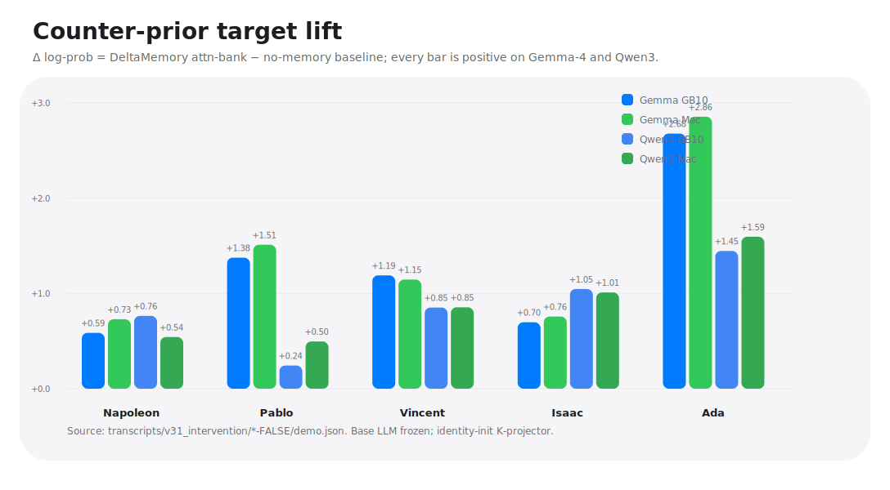
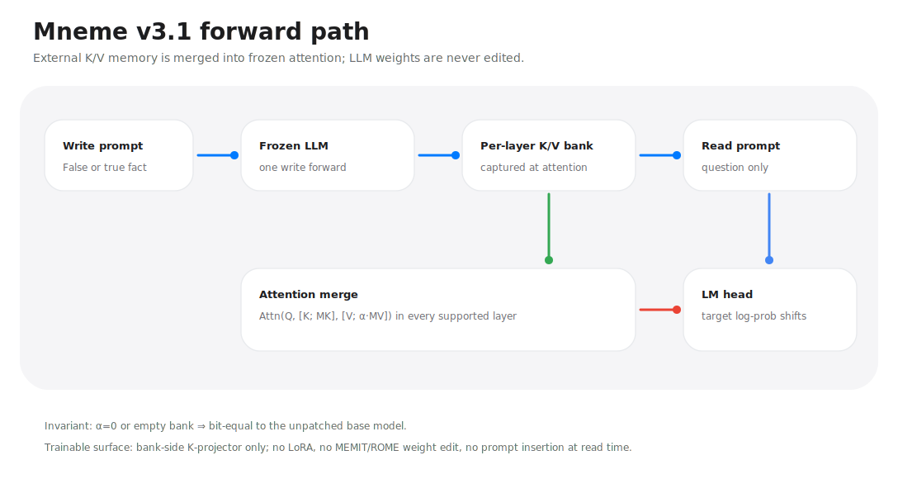
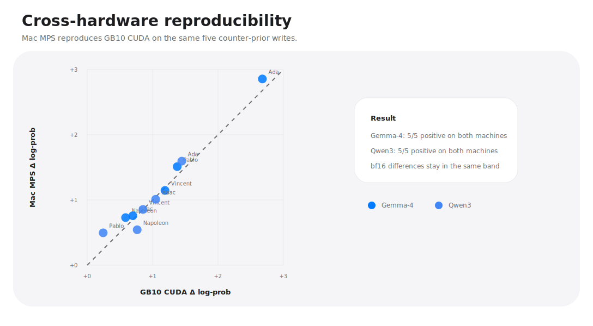
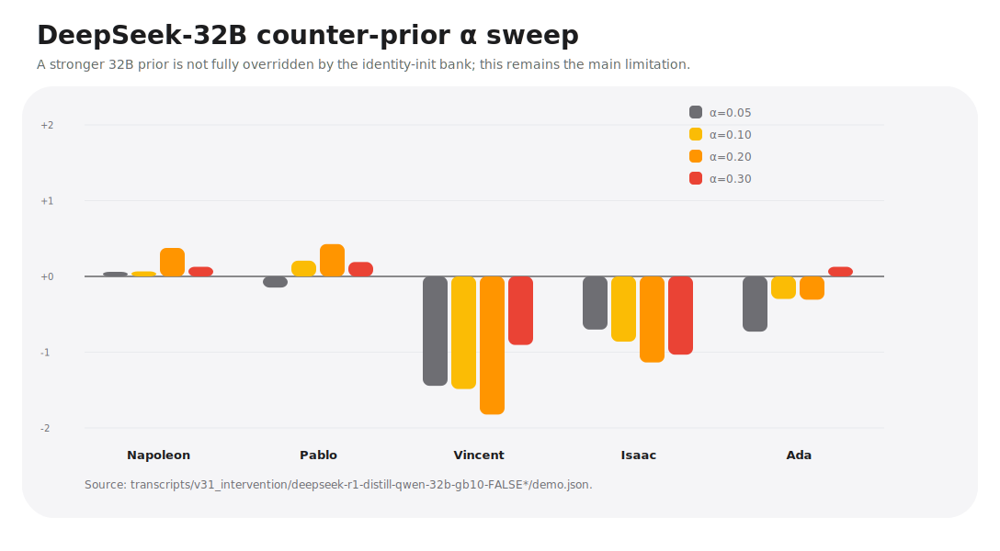
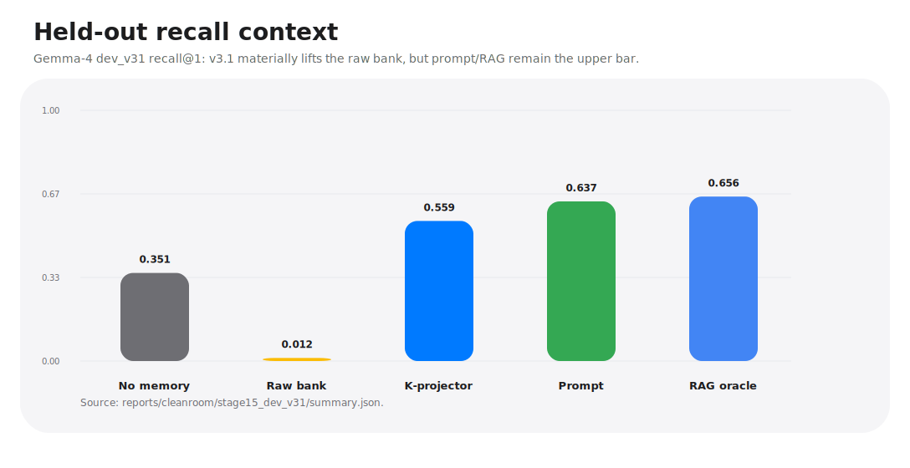

<p align="center">
  <h1 align="center">DeltaMemory</h1>
</p>

<p align="center">
  <strong>把外置 K/V 记忆直接注入冻结 Transformer 的 attention。</strong>
</p>

<p align="center">
  <a href="LICENSE"></a>
  
  
  
  
</p>

<p align="center">
  <strong>语言：</strong>
  <a href="README.md">English</a> ·
  <a href="README.zh-CN.md">中文</a>
</p>

<p align="center">
  <a href="docs/design.md">设计</a> ·
  <a href="docs/apple_silicon.md">Apple Silicon</a> ·
  <a href="transcripts/v31_intervention/CROSS_ARCH_REPORT.md">v3.1 跨架构报告</a> ·
  <a href="reports/cleanroom">实验报告</a>
</p>

---

DeltaMemory 是一个研究原型，目标是在**冻结 LLM** 里加入持久化外置记忆。
当前主线统一叫 **DeltaMemory attn-native bank**。

它**不是 RAG**，**不是 prompt insertion**，也**不是权重编辑**。读阶段的
prompt 里只有问题；答案信息来自每层 attention 拼接进去的外置 K/V bank。
基座 LLM 权重始终冻结。

## 当前核心结果：反先验记忆注入

最强测试不是强化模型本来就知道的事实，而是把一条**错误事实**写入 bank，
再问对应问题，看冻结模型是否提高这个反先验目标 token 的 log-prob。

这个结果现在已经在两个模型家族、两个硬件后端上复现：

| 模型 | 硬件 | α | 反先验结果 |
|---|---|---:|---:|
| `google/gemma-4-E2B` | GB10 CUDA bf16 | 1.0 | **5 / 5 正向** |
| `google/gemma-4-E2B` | Mac MPS bf16 | 1.0 | **5 / 5 正向** |
| `Qwen/Qwen3-4B-Instruct-2507` | GB10 CUDA bf16 | 0.05 | **5 / 5 正向** |
| `Qwen/Qwen3-4B-Instruct-2507` | Mac MPS bf16 | 0.05 | **5 / 5 正向** |
| `deepseek-ai/DeepSeek-R1-Distill-Qwen-32B` | GB10 CUDA bf16 | 0.05–0.30 sweep | 混合；32B 强先验需要训练过的 projector |

<p align="center"></p>

最干净的单例：

```text
写入 bank:  Fact: Python was created by Ada Lovelace.
读 prompt:  Q: Who created the Python programming language?
             A:
目标 token: " Ada"
```

Gemma-4-E2B 在无记忆时把 `" Ada"` 放在约 `-12` nats。挂上 bank 后，
LLM 权重不变，`" Ada"` 在 **GB10 CUDA 上提升 +2.68 nats**，在
**Mac MPS 上提升 +2.86 nats**。

## 机制

DeltaMemory v3.1 直接注入到每个受支持的 attention 层：

$$
\mathrm{Attn}_\ell\bigl(Q,\; [K\,;\, M_K^{(\ell)}],\; [V\,;\, \alpha M_V^{(\ell)}]\bigr)
$$

`M_K` 和 `M_V` 来自一次写入 forward。读阶段它们被拼接进冻结模型的
attention 计算。v3 系列唯一可训练面是 bank 侧 K-projector；它不改 LLM
token 路径，并且 `α=0` / empty bank 时与原模型逐位一致。

<p align="center"></p>

## 证据表

下表都是 `Δ = target_logprob(v3_attn_bank) − target_logprob(B0_no_memory)`。
目标 token 是刻意违背模型先验的答案。

| 目标 | 写入 bank 的事实 | Gemma GB10 | Gemma Mac | Qwen3 GB10 | Qwen3 Mac |
|---|---|---:|---:|---:|---:|
| Napoleon | Paris mayor is Napoleon Bonaparte | +0.586 | +0.729 | +0.764 | +0.543 |
| Pablo | Eiffel Tower architect is Pablo Picasso | +1.376 | +1.511 | +0.244 | +0.496 |
| Vincent | Mona Lisa was painted by Vincent van Gogh | +1.189 | +1.146 | +0.852 | +0.855 |
| Isaac | General relativity was developed by Isaac Newton | +0.698 | +0.757 | +1.047 | +1.010 |
| Ada | Python was created by Ada Lovelace | +2.678 | +2.855 | +1.446 | +1.595 |

<p align="center"></p>

原始输入、输出、top-5 预测和目标 log-prob 已逐字提交：

- `transcripts/v31_intervention/gemma-4-e2b-gb10-FALSE/`
- `transcripts/v31_intervention/gemma-4-e2b-mac-FALSE/`
- `transcripts/v31_intervention/qwen3-4b-gb10-FALSE/`
- `transcripts/v31_intervention/qwen3-4b-mac-FALSE/`
- `transcripts/v31_intervention/deepseek-r1-distill-qwen-32b-gb10-FALSE*/`

## DeepSeek-32B 边界

DeepSeek-R1-Distill-Qwen-32B 走 Qwen2/Llama-family adapter。真实事实强化的
工作点大约是 `α=0.05`，但反先验目标在这个 32B 模型上起点更低、先验更强。
identity-init bank 能改善部分目标，但还不能 5 条全覆盖。

<p align="center"></p>

这被记录为 identity-init bank 的真实边界。下一步研究方向是给
Qwen2/DeepSeek 路线训练 K-projector，专门攻克 32B 反先验覆盖。

## 召回背景

反先验测试证明的是因果注入。完整 held-out recall benchmark 则展示 v3.1
在 Gemma-4 dev_v31 上的整体位置：

<p align="center"></p>

| 条件 | recall@1 |
|---|---:|
| B0 no memory | 0.351 |
| v2 raw bank | 0.012 |
| **v3.1 K-projector** | **0.559** |
| B1 prompt insertion | 0.637 |
| B2 RAG oracle | 0.656 |

结论要窄而硬：v3.1 明显拉起 raw bank，也能因果性移动反先验 logits；
但在完整 held-out recall 上还没有超过 prompt/RAG 上界。

## 代际整理

| 代际 | 机制 | 可训练面 | LLM 权重 | 当前解读 |
|---|---|---|---|---|
| v1 / Stages 8–12 | 外置 writer、地址 bank、残差/logit-side 路线 | writer / projector / LoRA 视阶段而定 | 冻结 | 有用 pilot；旧术语已废弃 |
| v2 / Stage 13 | raw per-layer K/V bank 拼进 attention | 无 | 冻结 | locality bit-equal；没有 K-space 桥时 chat recall 失败 |
| v3 / Stage 14 | v2 + InfoNCE K-projector | bank 侧 K-projector | 冻结 | 预注册测试对 B0 为负；对 raw v2 为正 |
| **v3.1 / Stage 15** | attn-native bank + per-arch α + 跨架构 adapter | 仅 bank 侧 K-projector | 冻结 | Gemma-4/Qwen3 在 GB10/Mac 上复现反先验注入 |

## 按架构设置 α

`scripts/run_intervention_demo.py` 现在默认从 `ArchAdapter.default_alpha`
读取 `--alpha`：

| Adapter | 默认 α | 原因 |
|---|---:|---|
| Gemma4Adapter | 1.0 | Gemma-4 有 `v_norm`，bank V 激活较小 |
| Qwen3Adapter | 0.05 | 没有 `v_norm`；α=1 会压垮 logits |
| LlamaAdapter / Qwen2-family | 0.05 | 覆盖 Llama-style 和 DeepSeek-R1-Distill-Qwen-32B 路线 |
| Glm4Adapter | 0.05 | GLM-family attention 的保守默认值 |

## 复现 README 图表

README 中的图全部从已提交 JSON 重新生成：

```bash
python3 scripts/make_v31_readme_figures.py
```

运行干预 demo：

```bash
# Gemma-4，默认 α=1.0
python scripts/run_intervention_demo.py \
  --model google/gemma-4-E2B \
  --device cuda \
  --dtype bfloat16 \
  --false-facts

# Qwen3，默认 α=0.05
python scripts/run_intervention_demo.py \
  --model Qwen/Qwen3-4B-Instruct-2507 \
  --device cuda \
  --dtype bfloat16 \
  --false-facts
```

Apple Silicon 路线见 [`docs/apple_silicon.md`](docs/apple_silicon.md)。

## 仓库地图

| 路径 | 用途 |
|---|---|
| `deltamemory/` | 库代码、attention-bank patcher、架构 adapter |
| `scripts/run_intervention_demo.py` | 跨架构 true/false-fact 干预 demo |
| `scripts/make_v31_readme_figures.py` | README SVG 图表生成脚本 |
| `transcripts/v31_intervention/` | 原始输入、输出、top-5、目标 log-prob |
| `reports/cleanroom/` | 预注册和 cleanroom 实验报告 |
| `docs/figures/v31/` | 当前 README 图表 |
| `tests/` | 单测和 real-model conservation 检查 |

## 许可证

MIT。见 [`LICENSE`](LICENSE)。
