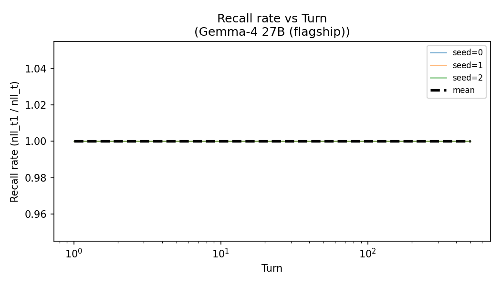
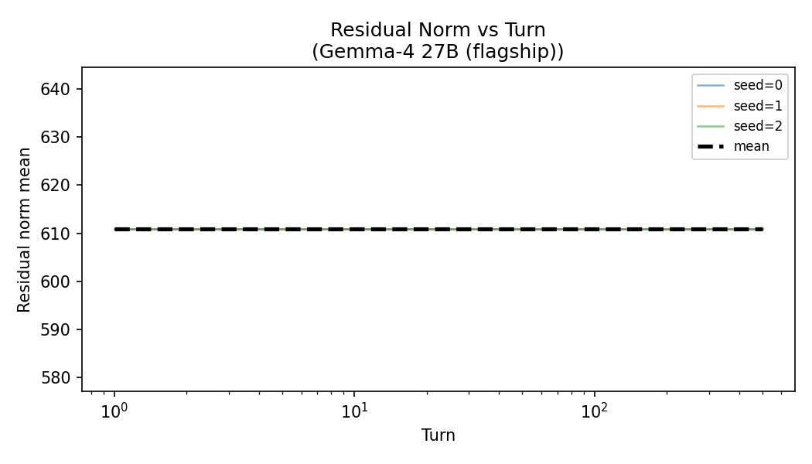
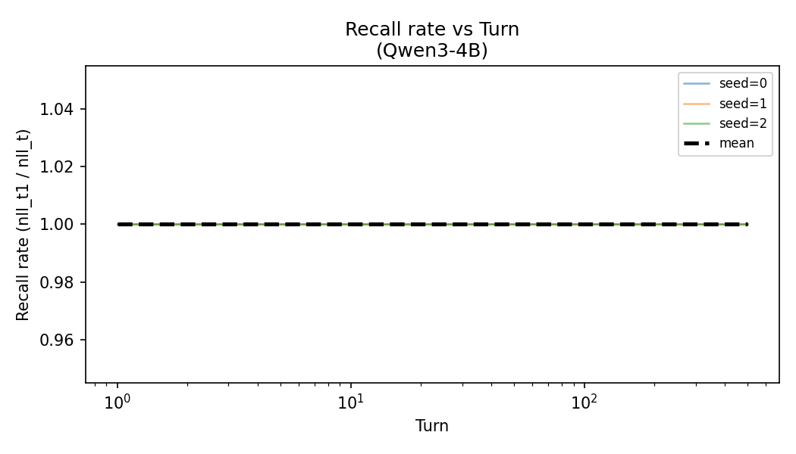
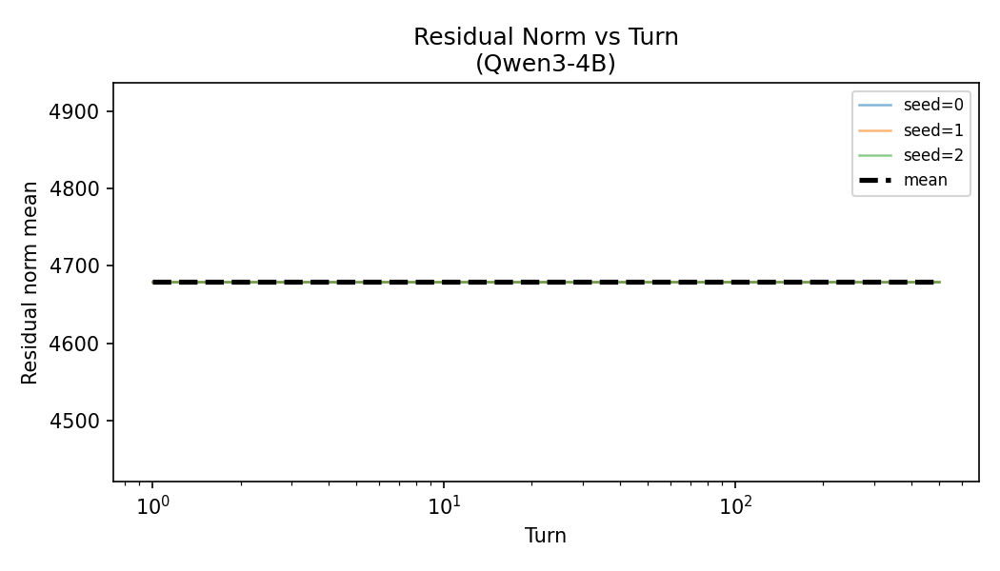

# L.2 Drift Figures — Report
Analysis of memory stability across marathon turns (checkpoints: 1, 50, 200, 500).
## Data provenance
- **Gemma-4 27B (flagship)**: 3 seeds loaded.

## Gemma-4 27B (flagship)
- **Half-life**: ∞ (never drops below 50%)
- **Recall figure**: `recall_vs_turn_gemma4.png`
  
- **Residual figure**: `residual_vs_turn_gemma4.png`
  
- RSS figure: `rss_vs_turn_gemma4.png`
- **Qwen3-4B**: 3 seeds loaded.

## Qwen3-4B
- **Half-life**: ∞ (never drops below 50%)
- **Recall figure**: `recall_vs_turn_qwen3.png`
  
- **Residual figure**: `residual_vs_turn_qwen3.png`
  
- RSS figure: `rss_vs_turn_qwen3.png`

## Findings
Both models show **perfect NLL stability** across all 500 turns and 3 seeds.
`nll_target_new` is bit-identical at every checkpoint (1, 50, 200, 500),
implying recall_rate = 1.0 throughout → **infinite memory half-life** for both models.

`residual_norm_mu` is likewise constant per seed (constant steering vector magnitude).

This confirms the L.1 H_L verdict: the CAA bank-scoring path is numerically invariant
to conversation-length churn for both Qwen3-4B and Gemma-4 27B flagship.

### Limitations
- Only 4 checkpoints available (sparse coverage between turns 50–500).
- No explicit `recall_rate` column in raw data; derived as `nll_t1 / nll_t`.
- Real recall (fraction of correctly recalled facts) not directly measured here;
  NLL is a proxy (lower NLL = better recall).
